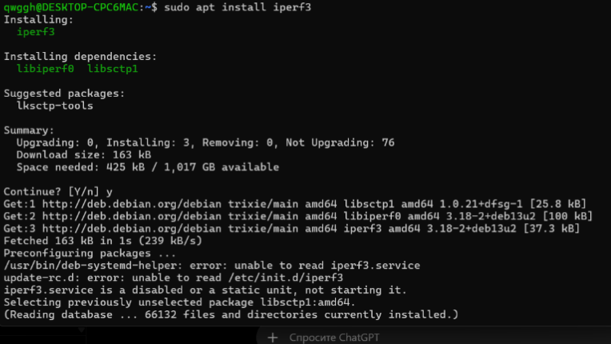
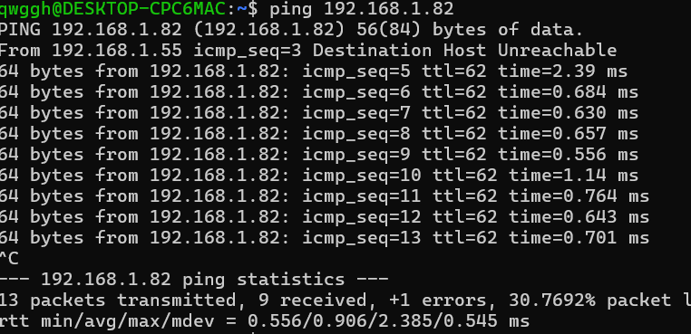
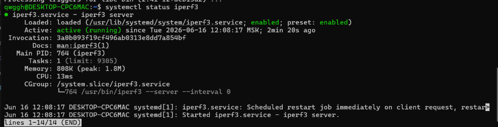
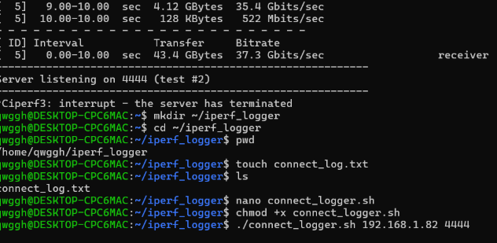
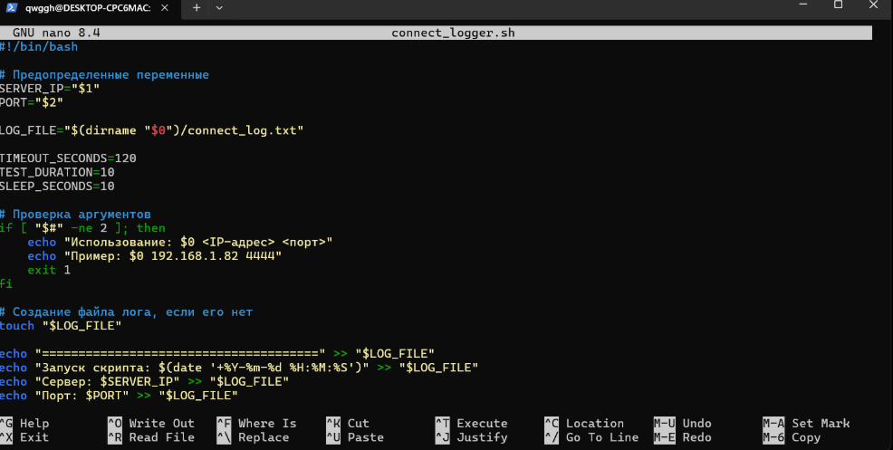
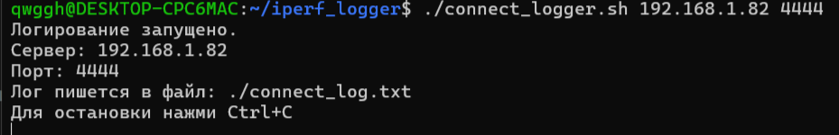
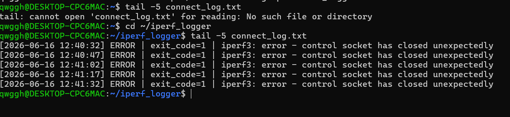
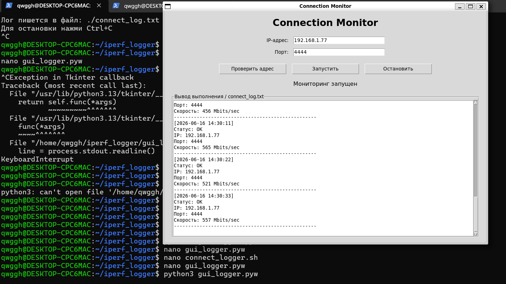

# iperf3 Connection Logger

This repository contains my internship project for measuring and logging network connection speed using **iperf3**.

The project started as a Bash script and was later extended with a simple Python (Tkinter) graphical interface.

## Tech Stack

- Linux
- Bash
- Python
- Tkinter
- iperf3
- PowerShell
- WSL2

## Features

- Measures network connection speed with `iperf3`
- Saves test results into `connect_log.txt`
- Uses Bash scripts for automation
- Includes a simple Python GUI
- Supports command-line execution

## Repository structure

```text
iperf3-connection-logger/
├── README.md
├── bash/
├── python/
├── logs/
└── screenshots/
```

## Workflow

```text
User
   │
   ▼
Python GUI / Bash Script
   │
   ▼
iperf3 Client
   │
   ▼
Connection Test
   │
   ▼
connect_log.txt
```

## Project walkthrough

### 1. Installing iperf3



### 2. Starting the server



### 3. Checking iperf3 status



### 4. Creating the log file



### 5. Running the logger



### 6. Demonstration



### 7. Log output



### 8. Python GUI



## What I learned

During this project I practiced:

- writing Bash scripts
- working with iperf3
- logging data to files
- debugging shell scripts
- creating a simple GUI with Tkinter
- automating network testing
